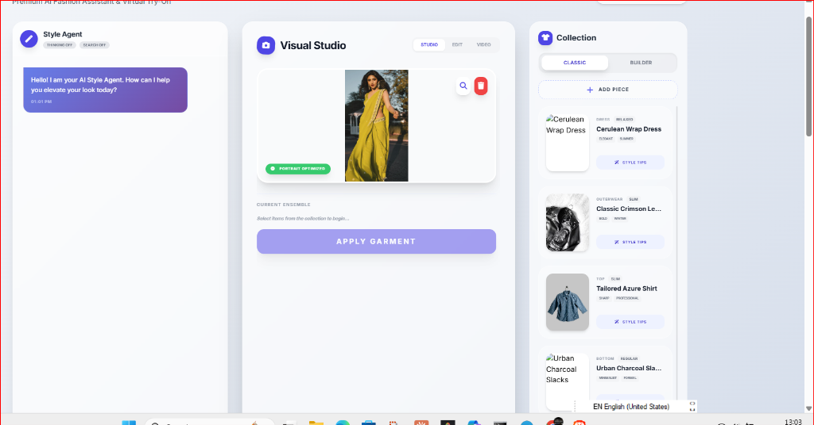

<div align="center">


# 👗 AI Style Studio: Virtual Try-On & Style Agent

[](https://reactjs.org/)
[](https://www.typescriptlang.org/)
[](https://vitejs.dev/)
[](https://tailwindcss.com/)
[](https://openai.com/)
[](https://www.anthropic.com/)

**Premium AI-powered personal stylist and virtual dressing room. Experience hyper-realistic virtual try-ons, expert style advice, and cinematic fashion showcases.**

[Explore App](https://ai.studio/apps/drive/1nMT7ezF-dJlaL9CjmN_J66lvnh-YPftZ) • [Report Bug](https://github.com/[INSERT_GITHUB_USERNAME]/[INSERT_REPO_NAME]/issues) • [Request Feature](https://github.com/[INSERT_GITHUB_USERNAME]/[INSERT_REPO_NAME]/issues)

</div>

---

## 📸 Screenshots

<div align="center">
  
  <p><em>The premium AI Style Studio interface featuring the AI Style Agent and Visual Studio.</em></p>
</div>

---

## 📖 Table of Contents
- [🌟 Motivation](#-motivation)
- [✨ Key Features](#-key-features)
- [🏗️ Architecture](#️-architecture)
- [🛠️ Technology Stack](#️-technology-stack)
- [🚀 Platform Support](#-platform-support)
- [📋 Prerequisites](#-prerequisites)
- [💻 Installation](#-installation)
- [⚙️ Configuration](#️-configuration)
- [🎯 Quick Start](#-quick-start)
- [💡 Usage Examples](#-usage-examples)
- [🧪 Running Tests](#-running-tests)
- [🤝 Contributing](#-contributing)
- [📄 License](#-license)
- [🙏 Acknowledgments](#-acknowledgments)

---

## 🌟 Motivation
In the fast-paced world of digital fashion, the bridge between browsing and "seeing yourself" in an outfit remains the biggest challenge. **AI Style Studio** was built to revolutionize the personal shopping experience. 

By leveraging cutting-edge Generative AI and Computer Vision, this project provides a premium, interactive environment where users can experiment with styles, receive expert advice from an AI stylist, and see hyper-realistic results—all before making a purchase.

---

## ✨ Key Features

### 🤖 AI Style Agent
- **Interactive Chat:** Real-time fashion advice through a sleek chat interface.
- **Voice-Enabled:** Support for voice transcriptions for a hands-free styling experience.
- **Context-Aware:** The AI understands your current selections and provides tailored style tips.

### 👔 Virtual Try-On & Studio
- **Hyper-Realistic Merging:** Seamlessly apply garments onto uploaded portraits with high fidelity.
- **Outfit Builder:** Dynamic composition mode for layering multiple garments.
- **Vision AI Overlay:** Technical breakdown mode confirming identity preservation and feature alignment.
- **Image Editing:** AI-driven refinements for lighting, texture, and silhouette.

### 🎬 Cinematic Showcase
- **AI Video Generation:** Transform your new look into a professional, cinematic runway showcase (powered by Veo/high-end video models).
- **Style Analysis:** Instant feedback on silhouette, fit, and color composition.

---

## 🏗️ Architecture

AI Style Studio is built with a modular and scalable architecture:

- **Frontend:** A responsive React application using a "Glassmorphism" design language for a premium aesthetic.
- **Component Model:** Structured into specialized modules like `ChatInterface`, `TryOnPanel`, and `CollectionCatalog`.
- **AI Service Abstraction:** A unified `AIService` interface with a `ServiceFactory` that intelligently switches between providers (**OpenAI**, **Anthropic**, **Gemini**) based on API key availability.
- **God Mode:** A robust mock service fallback for development and testing without live API keys.

---

## 🛠️ Technology Stack

- **Core:** React 19, TypeScript
- **Styling:** Vanilla CSS (Custom Glassmorphism system)
- **Build Tool:** Vite
- **AI Models:** 
  - Vision/Language: GPT-4o, Claude 3.5 Sonnet, Gemini 1.5 Pro
  - Video Generation: Google Veo (via AI Studio)
- **Icons:** FontAwesome

---

## 🚀 Platform Support

- **Browsers:** Chrome (v90+), Firefox (v88+), Safari (v14+), Edge (v90+)
- **Responsive:** Optimized for Desktop, Tablet, and Mobile devices.

---

## 📋 Prerequisites

- **Node.js:** v18.0.0 or higher
- **npm:** v9.0.0 or higher
- **API Keys:** One or more of the following:
  - OpenAI API Key
  - Anthropic API Key
  - Google Gemini API Key

---

## 💻 Installation

1. **Clone the repository:**
   ```bash
   git clone https://github.com/parmarjh/Style-Studio/tree/main.git
   cd [Style-Studio]
   ```

2. **Install dependencies:**
   ```bash
   npm install
   ```

### 🍎 Linux Dependencies (Optional)
On some Linux distributions, you may need basic build tools for certain dependencies:
```bash
sudo apt-get update
sudo apt-get install build-essential
```

---

## ⚙️ Configuration

Create a `.env.local` file in the root directory and add your API keys:

```env
# Optional: Providers are prioritized OpenAI > Anthropic > Gemini
VITE_OPENAI_API_KEY=your_openai_key
VITE_ANTHROPIC_API_KEY=your_anthropic_key
VITE_GEMINI_API_KEY=your_gemini_key
```

> [!NOTE]
> If no API keys are provided, the app will enter **God Mode**, providing a simulated experience for testing UI/UX.

---

## 🎯 Quick Start

1. **Start the development server:**
   ```bash
   npm run dev
   ```
2. **Open the application:**
   Navigate to `http://localhost:5173` in your browser.

---

## 💡 Usage Examples

### 1. Style Advice
Simply type in the chat: *"What goes well with a charcoal wool overcoat?"* or click the **Style Tips** button on any garment in the collection.

### 2. Virtual Try-On
1. Upload a clear portrait in the **Visual Studio**.
2. Select one or more items from the **Collection**.
3. Click **Apply Ensemble** to see the AI transform your look.
4. Toggle **Vision AI** to see the technical alignment mapping.

---

## 🧪 Running Tests

> [!IMPORTANT]
> Testing suite implementation is in progress.

To run the current test suite (if available):
```bash
npm run test
```

---

## 🤝 Contributing

We welcome contributions! Please follow these steps:
1. Fork the Project.
2. Create your Feature Branch (`git checkout -b feature/AmazingFeature`).
3. Commit your Changes (`git commit -m 'Add some AmazingFeature'`).
4. Push to the Branch (`git push origin feature/AmazingFeature`).
5. Open a Pull Request.

---

## 📄 License

Distributed under the MIT License. See `LICENSE` for more information.

---

## 🙏 Acknowledgments

- [Google AI Studio](https://ai.studio/) for the initial platform.
- The open-source communities behind React and Vite.
- FontAwesome for the elegant iconography.

---
<div align="center">
Built with ❤️ by AI Style Studio Team
</div>
